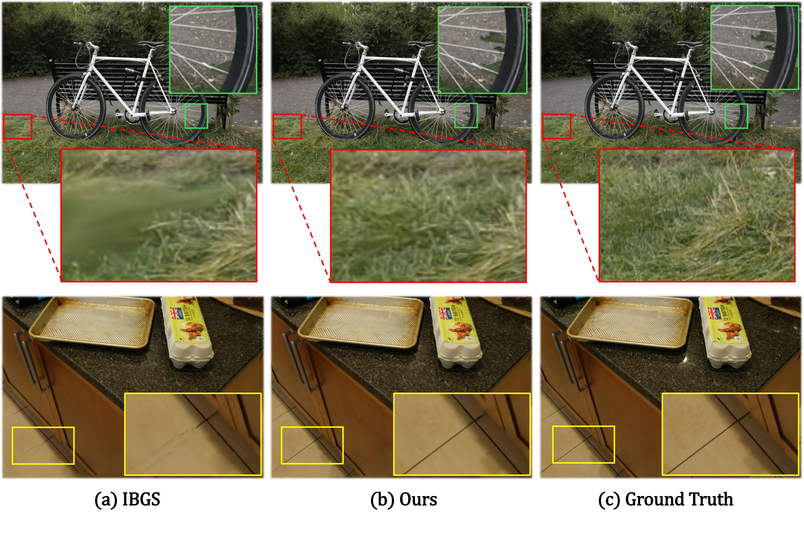

# GADA: Geometry-Aware Deformable Aggregation for Image-Based Gaussian Splatting
[Siwoo Lim](https://siw00-lim.github.io/)<sup>1</sup> · [Sunjae Yoon](https://dbstjswo505.github.io/)<sup>2</sup> · [Gwanhyeong Koo](https://kookie12.github.io/)<sup>1</sup> · [Chang D. Yoo](https://sanctusfactory.com/family.php)<sup>1</sup>

<sup>1</sup> Korea Advanced Institute of Science and Technology (KAIST) &nbsp;·&nbsp; <sup>2</sup> Chung-Ang University

<a href='https://siw00-lim.github.io/GADA-Project-Page/'></a>
<a href='<ARXIV_URL>'></a>
<a href='<GOOGLE_DRIVE_URL>'></a>

### [Paper]() | [Project Page](https://siw00-lim.github.io/GADA-Project-Page/) | [Pretrained Images](https://drive.google.com/file/d/1NVFaTcrwE5A1dO_AzEZEU1QBANmPTpo_/view?usp=sharing)


---

## 🚧 Code Release
**We plan to release the full training and evaluation code for GADA in the near future.**
This repository currently serves as a placeholder; the official implementation, configuration files, and reproduction scripts will be uploaded here once the cleanup is complete.

In the meantime, you can already access:
- 📄 The paper on [OpenReview]()
- 🌐 The [project page](https://siw00-lim.github.io/GADA-Project-Page/) with qualitative comparisons
- 🖼️ The **pretrained rendering results** used in our paper, available via the Google Drive link below

Please ⭐ **star** or **watch** this repository to get notified when the code is released.

---

## 🖼️ Pretrained Images
We provide the rendering results used in our paper (Mip-NeRF 360, Tanks & Temples, Deep Blending, and Shiny scenes) for direct qualitative comparison.

🔗 **Download:** [Google Drive — GADA Pretrained Images](https://drive.google.com/file/d/1NVFaTcrwE5A1dO_AzEZEU1QBANmPTpo_/view?usp=sharing)

The drive contains, for each scene, the rendered outputs of:
- Ground Truth
- GADA (Ours)

These are the exact images used to produce the qualitative comparisons in Figure 6 and the project page slider.

---

## ⚙️ Installation
*Coming soon — installation instructions will be added together with the code release.*

<!--
```bash
git clone https://github.com/siw00-lim/GADA.git
cd GADA
conda create -n gada python==3.8
conda activate gada
# ...
```
-->

## 📂 Dataset
We use the standard benchmark datasets following [3DGS](https://github.com/graphdeco-inria/gaussian-splatting):
- [Mip-NeRF 360](https://jonbarron.info/mipnerf360/)
- [Tanks and Temples](https://www.tanksandtemples.org/)
- [Deep Blending](http://visual.cs.ucl.ac.uk/pubs/deepblending/)
- [Shiny](https://nex-mpi.github.io/) — preprocessed via COLMAP, following the protocol used by [IBGS](https://github.com/HoangChuongNguyen/ibgs).

## 🚀 Training and Evaluation
Coming soon — training and evaluation scripts will be released alongside the code.

---

## 📝 Citation
Please consider citing our work if you find it useful for your research:
```bibtex
```

## 🙏 Acknowledgement
We build our method upon the codebase of [IBGS](https://github.com/HoangChuongNguyen/ibgs), [3DGS](https://github.com/graphdeco-inria/gaussian-splatting), and [PGSR](https://github.com/zju3dv/PGSR). We sincerely thank the authors for releasing their excellent code.
